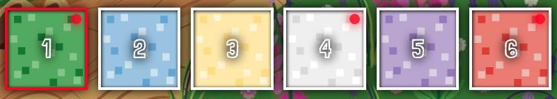
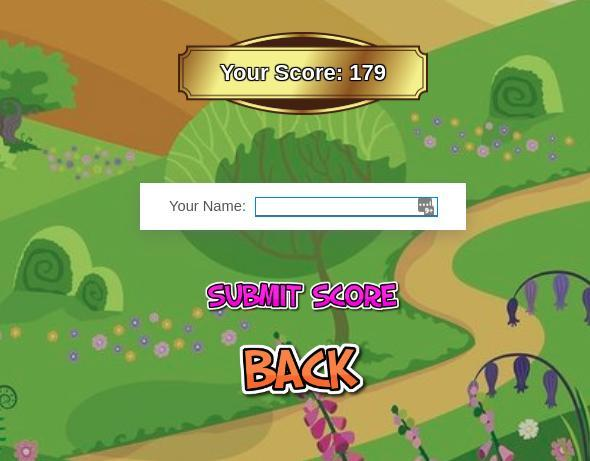
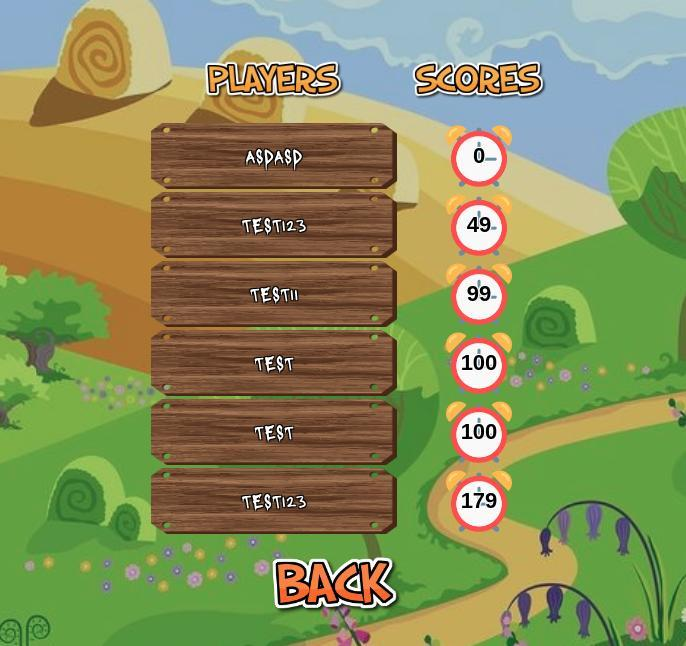
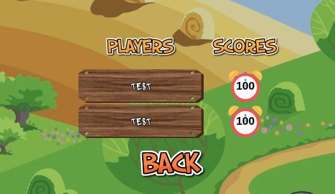

# WHACK-A-MOLE 3D
***Made by Richard Folea***
___
***[Live Demo](https://aelof3.github.io/wam/)***
___

## Instructions:  
Click `START GAME` on the main screen to begin
Click `LEADERBOARD` on the main screen to see high scores
#### CONTROLS:  
- **PC:** use the number keys `1-6` to rotate to each labeled cube side, or, click the buttons at the bottom that correspond to each side  
- **MOBILE:** tap the buttons at the bottom to switch to the matching side  

> *Red dots in the corner of the bottom buttons indicate at least one mole present on that side*
>   
> *Press the number key that matches the side with a red dot to spin the cube and put that side on top*

#### HOW TO WIN:  
> *Bonk 100 moles to fill up the mole meter in as little time as possible*
>   
> *If you do well, share your score on the leaderboard at the end!*
 

___

___
***Click a user to see their best scores!***

___  
## Check it out!

___  
___  

### To-do:
- revisit the individual components and try to minimize rendering
- add survival mode
- add seeded randomization