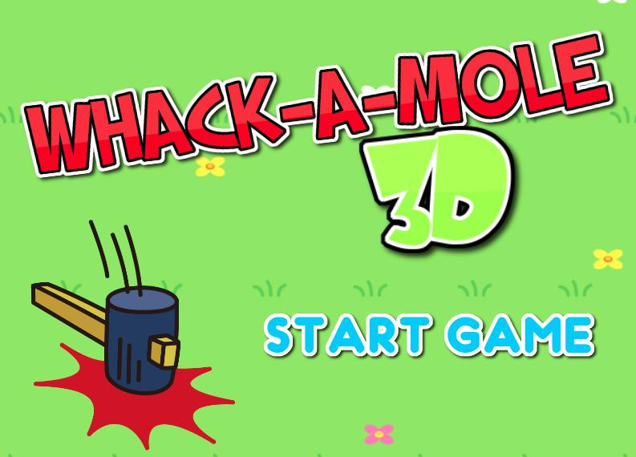
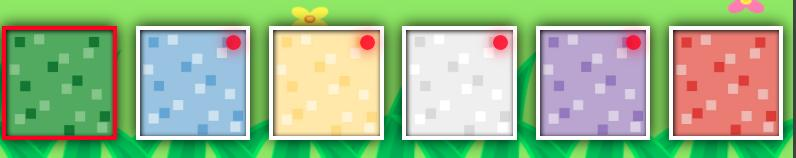

# WHACK-A-MOLE 3D
***Made by Richard Folea***
___
***[Live Demo](https://aelof3.github.io/test-wam/)***
___

### **Instructions:**
- Click `START GAME` on the main screen to begin
- on PC use the number keys `1-6` to rotate to each respective side,
    or, click the buttons at the bottom that correspond to each side
- on mobile, tap the buttons at the bottom to switch to the matching side
- Get 100 points in as little time as possible
- If you do well, share your score on the leaderboard at the end!

*Red dots in the corner of the bottom buttons indicate at least one mole present on that side*
  
___  

- add back end for leaderboard
- make styles look nice
- possibly switch out sprites for custom versions
- revisit the individual components and try to minimize rendering
- add survival mode
- add seeded randomization